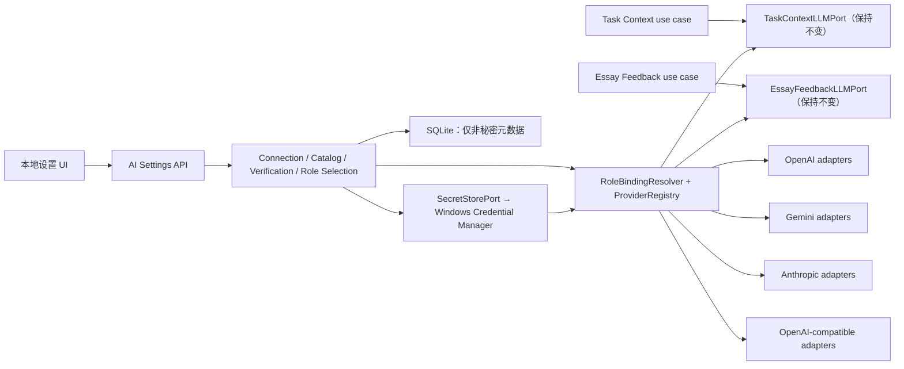

# Phase 3.6 — Personal Usable AI 架构增量

## 1. 状态、目标与非目标

- 状态：实现前架构契约已冻结。
- **Personal MVP 边界**：仅总指挥本人、当前 Windows 用户、可信本机；server 只监听 `127.0.0.1`，不向第二个人分发。
- **Pre-release Hardening 触发条件**：任何第二个人安装、测试或 beta 分发前，必须完成本文标为延期的本机多用户安全项。
- **Personal MVP 必须实现**：Windows Credential Manager、server-only secret、Provider abstraction、`RoleBindingResolver + ProviderRegistry`、四类 Provider、基础与产品 capability/role verification、明确费用确认的 paid probe、`requestId` 幂等、SDK retry 禁用、no silent fallback、model/request snapshot、Custom fail-closed、UI/`ENV_DEV` 来源分离，以及 loopback/no-CORS/unsafe API 基本 same-origin/CSRF 防护。
- **Pre-release Hardening 延期**：`LocalSessionGate`、named-pipe bootstrap、current-SID 双向验证、pipe PID↔TCP listener 绑定、跨 Windows 用户隔离、port squatting、fake pipe/fake health 防护及第二普通 Windows 用户攻击测试；其余仅因交给其他用户安装使用而需要的本机多用户安全机制同属该阶段。
- 唯一目标：用户不使用终端、不修改配置文件，通过本地 UI 配置自己的 Provider/API Key，分别选择题图识别与作文反馈模型，并完成一次真实 IELTS Academic Task 1 识图、写作和非官方反馈。
- Provider 仅限 `OPENAI | GEMINI | ANTHROPIC | OPENAI_COMPATIBLE`。
- 模型角色仅限 `TASK_CONTEXT | ESSAY_FEEDBACK`。
- 本增量不进入 realtime sentence/paragraph coach、Student Memory、formal Assessment、Task 2、Teacher KB、自动 fallback、模型市场、费用统计或 Phase 4。
- Phase 3 的 `TaskContextLLMPort` 与 Phase 3.5 的 `EssayFeedbackLLMPort` 保持不变；Phase 3/3.5 已验收的 Schema、重试预算、错误 owner 与 HTTP 语义除本文明确的 additive 配置前置检查外均不重写。

结论：**Phase 3.6 Personal MVP architecture approved for implementation planning**。当前无须总指挥拍板的架构 blocker；实现风险与测试门禁见 §12–§14。Pre-release Hardening 不属于本轮 Personal MVP 实施门禁。

## 2. 方案比较与选择

| 方案 | 结论 | 原因 |
|---|---|---|
| A. 保留两个业务 Port；组合根通过角色选择快照和 Provider registry 创建对应 adapter | **采用** | 业务用例继续只认识 Task Context / Essay Feedback；供应商协议差异被限制在基础设施层；可冻结请求快照且不改已验收 Port。 |
| B. 用一个公共 `AiProviderAdapter.execute(...)` 替换两个业务 Port | 不采用 | image、schema、拒答和结束原因会迫使万能请求/响应持续膨胀，并把供应商 transport 概念泄漏给业务层。 |
| C. Route/job 直接按 Provider 分支并实例化八个 adapter | 不采用 | 初期文件少，但连接、凭证、验证、错误映射和快照逻辑会重复，容易绕过费用与安全门禁。具体 adapter 仍可按“供应商 × 角色”存在，但只能由统一 registry/factory 创建。 |

采用方案的边界如下：

## 3. 最小 Provider 抽象

### 3.1 业务能力层

- `TaskContextLLMPort` 是“从题图得到本产品 Task Context”能力，不是 vision transport。
- `EssayFeedbackLLMPort` 是“从作文得到本产品非官方反馈”能力，不是通用 text generation transport。
- 两个 LLM Port 的请求/结果类型及七个稳定失败码 `TIMEOUT | NETWORK | INVALID_JSON | INVALID_STRUCTURE | REFUSAL | INCOMPLETE | TERMINAL` 均保持不变；application orchestration 仅有 §8.2 明示的 additive readiness dependency/result 分支。
- Provider、endpoint、API key、SDK 类型、原始 HTTP 状态与模型目录不得进入业务 Port。

### 3.2 应用选择层

本阶段需要以下四个小概念，但不建立通用 AI 平台：

1. `ProviderConnection`：一个本地 Provider 配置。V1 每种 Provider 最多一个连接；官方三家 endpoint 固定，Custom 额外保存一个 Base URL 和一个 Model ID。数据库只存非秘密配置、`secretRef` 和 `configRevision`。
2. `ModelCatalogService`：合并小型、带版本的 known metadata、Provider 可见模型与本地验证记录，向 UI 返回候选和状态；它不是全球模型数据库。
3. `ModelCapability`：基础能力采用三态 `SUPPORTED | UNSUPPORTED | UNKNOWN`；产品角色兼容性来自验证记录，不能由“支持图片/文本”直接推导。
4. `RoleBindingResolver`：按角色读取当前 selection，确认验证仍有效，冻结 invocation snapshot，再交给 Provider registry 创建相应业务 Port adapter。

不增加面向业务层的统一 `AiProviderAdapter`。基础设施内部可以有最小 `ProviderDriver`/registry，其职责只包括：连接测试、模型发现、角色验证，以及根据已冻结 snapshot 创建 `TaskContextLLMPort` 或 `EssayFeedbackLLMPort`。它不得提供一个可被业务层任意调用的通用 generate 方法。

### 3.3 Provider transport 层

- OpenAI、Gemini、Anthropic、OpenAI-compatible 各自拥有 transport client、请求编码、canonical schema projection、响应状态解释和错误分类。
- 每个供应商可以实现两个薄角色 adapter，或让两个角色 adapter 复用其私有 client；不得假定四家请求或响应完全相同。
- SDK 自动重试全部显式关闭。Phase 3 Task Context 既有“最多两次调用”仍由 application processor 管理；每次 adapter 调用只产生一次供应商请求。连接测试和 capability probe 不重试。
- timeout 由服务端明确设置；不得使用供应商 SDK 随版本变化的隐式默认值。
- Provider/secret routes、resolver 和 adapter 必须运行在 Next.js Node server runtime，禁止进入 Edge runtime 或 client bundle。所有 Provider credential 只通过 SDK auth 参数或安全 header 发送，禁止 query string、telemetry 和跨 origin redirect；Custom V1 只使用标准 `Authorization: Bearer`。
- Task Context job 从 attempt snapshot 创建 lazy `TaskContextLLMPort`：adapter/secret 构造失败也必须在 `executeTaskContext` 内归一化为既有失败码，不能 throw 绕过 processor。永久缺失/无权限映射 `TERMINAL`，明确瞬态 secret-store/transport 故障按现有规则映射 `NETWORK/TIMEOUT`；processor 仍是调用预算与 attempt 终态的唯一 owner，`JobPort` 不接管。

## 4. Provider-specific adapter 契约

### 4.1 对上层稳定的归一化规则

adapter 必须在 transport 边界完成以下工作：

- 把 `bytes + mediaType` 转成供应商原生 image input；不得把私有图片变成公共 URL。
- 从本产品 canonical JSON Schema 生成供应商支持的 schema 表达。projection 可以改写等价关键字，但不得删减必填字段、放宽枚举或绕过领域校验；无法忠实表达时，该模型/endpoint 对相应角色为 `INCOMPATIBLE`。
- 识别供应商机器可读的 refusal/safety block、incomplete/max-token/异常 stop reason；不得用模型自然语言关键词猜测拒答。
- 将 timeout、网络、认证、权限、配额/限流、模型不存在、unsupported feature、5xx 与无效响应先归一化为内部 `ProviderFailure`，不向 UI/业务泄漏原始 body、header、stack 或 SDK 对象。
- adapter 负责 JSON decode；业务 use case 继续负责 Zod、交叉引用与领域语义校验，保持 Phase 3/3.5 的 `INVALID_JSON` / `INVALID_STRUCTURE` owner。

内部 `ProviderFailure` 到既有业务 Port 的映射冻结为：

| Provider 分类 | 业务 Port 失败码 |
|---|---|
| 请求 deadline 到期 | `TIMEOUT` |
| DNS/连接/TLS/可重试 5xx/瞬时 rate-limit 或 overload | `NETWORK` |
| 响应无法解码为 JSON | `INVALID_JSON` |
| 已解码但本产品 Schema/语义无效 | 由 use case 返回 `INVALID_STRUCTURE` |
| 明确 refusal 或 safety block | `REFUSAL` |
| 明确 incomplete、max token 或无可发布完整结构 | `INCOMPLETE` |
| auth/permission/model missing/明确 unsupported/hard quota、credit 或 billing exhausted/其余非重试终态 | `TERMINAL` |

Provider 设置与验证 API 使用 §10 的更细错误码；七个业务失败码不扩容。

### 4.2 截至 2026-08-14 的 adapter 实现事实

下表是 provider adapter 的当前实现依据，不是业务公共契约。供应商协议变化时只更新对应 adapter、known metadata 和 `adapterContractVersion`；已有验证随版本指纹失效。

| Provider | 当前官方事实与 adapter 处理 |
|---|---|
| OpenAI | Responses API 的图像输入可用 URL、Base64 data URL 或 file ID；本地 adapter 使用 bytes 构造 data URL。Structured Outputs 使用 JSON Schema 子集；响应需要分别处理 refusal 与 incomplete。Models API 只返回 ID/owner 等基本信息，不能作为 capability 真相源。见 [Vision](https://developers.openai.com/api/docs/guides/images-vision)、[Structured Outputs](https://developers.openai.com/api/docs/guides/structured-outputs)、[Errors](https://developers.openai.com/api/docs/guides/error-codes)、[Models API](https://developers.openai.com/api/reference/resources/models/methods/list)。 |
| Gemini | 图像可 inline bytes 或 Files URI；本地短探针和运行调用优先 inline bytes。Structured output 只支持 JSON Schema 子集；canonical schema 中的 `const` 投影为显式 `type + enum[单值]`，`format: uuid` 仍由本地 Zod 验证。安全/finish 信号按机器字段归一化。Models API 没有 image/structured-output capability 字段，不能据此过滤。JS SDK 的 retry attempts 必须显式设为 1。见 [Image understanding](https://ai.google.dev/gemini-api/docs/image-understanding)、[Structured output](https://ai.google.dev/gemini-api/docs/structured-output)、[Models API](https://ai.google.dev/api/models)、[API errors](https://ai.google.dev/gemini-api/docs/api-errors)、[HttpRetryOptions](https://googleapis.github.io/js-genai/release_docs/interfaces/types.HttpRetryOptions.html)。 |
| Anthropic | Messages API 使用 image content block，可承载 Base64/URL/Files；本地 adapter 使用 Base64 source。Structured Outputs 当前使用 `output_config.format`；refusal、stop reason、max tokens 和 API error 分开处理。Models API 可提供 image input / structured output 的基础 capability 元数据，但仍不能证明本产品 Schema 兼容。见 [Vision](https://platform.claude.com/docs/en/build-with-claude/vision)、[Structured Outputs](https://platform.claude.com/docs/en/build-with-claude/structured-outputs)、[Stop reasons](https://platform.claude.com/docs/en/build-with-claude/handling-stop-reasons)、[API errors](https://platform.claude.com/docs/en/api/errors)、[Models API](https://platform.claude.com/docs/en/api/models/list)。 |
| OpenAI-compatible | V1 只承诺一个窄的 **OpenAI Responses-compatible** profile：`POST {baseUrl}/responses`、OpenAI 风格 image input、原生 JSON Schema structured output；`GET {baseUrl}/models` 可选。不要实现 Chat Completions fallback、prompt-only JSON、任意 header/path 模板或厂商特例。endpoint 不满足该 profile 时明确 `INCOMPATIBLE`，UI 文案必须说明“OpenAI-compatible 不保证可用”。 |

具体模型 ID 不属于长期架构契约。known catalog 只能收录在核验日期仍有官方 image/structured-output 证据的精确 stable/pinned ID；禁止滚动 `latest`、preview 或仅凭命名猜 capability。退役或新模型通过版本化 metadata 更新，不改业务 Port。

## 5. 本地凭证安全

### 5.1 决策与威胁边界

Windows 个人应用 V1 采用 **Win32 Credential Manager**：`CRED_TYPE_GENERIC` + `CRED_PERSIST_LOCAL_MACHINE`，由服务端进程通过窄的首方 Node-API 原生桥调用 `CredWriteW`、`CredReadW`、`CredDeleteW`。这里的 `CRED_PERSIST_LOCAL_MACHINE` 表示同一 Windows 用户在同一台电脑的后续登录会话可读；它不同于 DPAPI 的 `CRYPTPROTECT_LOCAL_MACHINE`（同机其他用户也可能解密），后者禁止使用。

官方依据：[CREDENTIALW](https://learn.microsoft.com/en-us/windows/win32/api/wincred/ns-wincred-credentialw)、[CredWriteW](https://learn.microsoft.com/en-us/windows/win32/api/wincred/nf-wincred-credwritew)、[CredReadW](https://learn.microsoft.com/en-us/windows/win32/api/wincred/nf-wincred-credreadw)、[CredDeleteW](https://learn.microsoft.com/en-us/windows/win32/api/wincred/nf-wincred-creddeletew)、[DPAPI flags](https://learn.microsoft.com/en-us/windows/win32/api/dpapi/nf-dpapi-cryptprotectdata)、[Node-API](https://nodejs.org/api/n-api.html)。

- 不采用明文 SQLite、localStorage、持久 JSON 文件、`.env` 写回或日志。
- 不采用 `PasswordVault` 的 Microsoft 账户漫游语义。
- `SecretStorePort` 只能在 server-only infrastructure 中引用；不得进入 client bundle、React props、GET DTO 或测试快照。
- Generic Credential 可防止磁盘明文和跨普通用户读取，但不能抵御已控制当前 Windows 用户、管理员权限、本进程 RCE 或内存抓取；V1 不宣称具备这些能力。
- 应用必须以当前交互用户运行，不作为共享 service account 服务。

### 5.2 浏览器到 secret store 的数据流

1. 设置页使用 password input 收集 Key；浏览器只在本次 `PUT` 请求内持有明文。
2. Personal MVP 的本地 server 仅绑定 `127.0.0.1`，不开放 CORS；所有 unsafe 变更/测试请求要求 JSON、基本 same-origin `Host`/`Origin` 与 CSRF 校验，避免恶意网页改配置或触发付费请求。Key 只可短暂存在于该同源 PUT request body 与 server memory；不得进入 response、持久 JSON、缓存或日志。Launcher 继续现有个人本机可信模型，不增加复杂 IPC。
3. server 校验后把 Key 直接写入 Credential Manager；target name 由固定应用前缀、Provider kind、不可猜用途的 connection ID 和 secret revision 在服务端生成，客户端不能指定。
4. SQLite 只写 `secretRef`、`secretRevision` 和配置 revision，不冗余保存 Key 存在性。GET 根据引用与 secret store 可读状态返回 `keyConfigured`/安全状态；API handler 禁止记录 request body，Provider 日志统一脱敏。
5. 保存成功后前端立即清空输入值。以后 `GET /api/ai/settings` 只返回 `keyConfigured: true|false`；不返回真实 Key、掩码串、长度或末四位。UI 显示“已配置”，更换 Key 必须重新输入。

Key 更新采用先写新版本 credential、再事务切换数据库引用的顺序；数据库失败则删除本次新 credential。轮换/删除先在同一 SQLite 写事务中切换或 tombstone connection，并与“读取 current selection + 插入 attempt/probe snapshot”串行；事务提交后才按 durable 引用清理旧 credential。清理前必须确认没有未完成 Task Context attempt 或 `CLAIMED` probe 引用；删除失败只留下 OS-backed orphan 并记录稳定 cleanup 状态，不回滚到旧配置。Feedback 必须先原子读取 secret 到 request memory，之后清理才可继续；设置在反馈期间变化时，last-success 只做条件更新，条件不匹配不得让已完成反馈失败。secret store 不可用时 fail closed，绝不降级到明文文件或环境变量。

### 5.3 Pre-release Hardening（不属于 Personal MVP）

以下设计完整保留，但只在准备交给第二个人安装/测试前实施，不是当前 Personal MVP 的实现或 release gate：

loopback 并不隔离同机其他 Windows 用户，因此届时增加非账号型 `LocalSessionGate`：server 每次启动生成高熵内存 secret，Launcher 通过显式 current-SID DACL、拒绝 remote client 的本地 IPC（优先 Windows named pipe）取得短 TTL、单次 bootstrap nonce；nonce 放在 URL fragment 中交给页面，页面兑换后立即 `history.replaceState` 清除 fragment。应用不把 nonce/session 写入自己的持久文件、localStorage 或日志；fragment 不进入 HTTP request/referrer/app access log，但默认浏览器启动元数据可能短暂携带它，属于已声明的当前用户威胁边界。session cookie 只含随机会话能力，绑定 server startup epoch，server 重启即失效。

`POST /api/local-session/exchange` 是除公开 health/readiness 外唯一无需已有 session 的本地 API：只接收 JSON `{ nonce }`，要求 exact Host/Origin，校验短 TTL 与单次使用；成功设置 host-only `HttpOnly; SameSite=Strict; Path=/` cookie、建立 CSRF token 并返回 `Cache-Control: no-store`，失败统一 401 且不泄露 nonce 状态。其余全部 `/api/ai/*` 以及任何可配置、排队或触发 Provider 的业务 endpoint（明确包括题图 upload/retry 与 Feedback POST）都必须有 local session + exact Host。safe GET 必须无业务状态变更、`no-store`，Origin 存在时校验；所有 unsafe method、付费、排队或 Provider inference 还必须有 exact Origin + CSRF。connection/models GET 最多做无 inference 的只读 metadata discovery，按 safe GET 处理。这不是账号系统，也不做云身份。

Launcher 不能只因公开 `/api/health` 成功就打开设置页。IPC 必须双向验证 OS 身份：server 验证 launcher client SID，Launcher 验证 named-pipe server process SID 为当前用户，并验证 pipe server PID 与 127.0.0.1:3000 listener PID 属于同一已验证应用实例（允许显式验证的父子进程链）。health 成功但 pipe、SID、PID/listener 或应用协议不匹配时必须中止并显示安全错误，不能打开浏览器或交付 nonce；这阻止另一普通 Windows 用户抢占端口/伪造 pipe 后钓取 API Key。

## 6. Model catalog、capability 与产品验证

### 6.1 两层 capability

基础 capability 每项均为三态，至少包含：

- `textInput`
- `imageInput`
- `structuredOutput`

产品 compatibility 不作为基础 capability 布尔值存储，而由当前验证指纹下的角色状态派生：

- `taskContextCompatible := TASK_CONTEXT verification == VERIFIED`
- `essayFeedbackCompatible := ESSAY_FEEDBACK verification == VERIFIED`

因此，“支持图片”不等于能生成本产品 strict Task Context；“支持文本/JSON”也不等于能稳定生成 Essay Feedback schema。

### 6.2 capability 来源与 fail-closed 规则

1. **Known metadata**：项目维护很小的、带 `catalogVersion/reviewedAt/evidenceUrl` 的官方 Provider 精确模型清单，声明可由官方文档证明的基础能力；不是永久真相。
2. **Runtime availability**：配置 Key 后调用 Provider 模型 list/get，确认当前账户可见性。OpenAI/Gemini 的模型元数据不足以声明 image/structured output；Anthropic 的基础 flags 也不能声明产品角色兼容。
3. **Product verification**：按 connection + model + role 执行本产品最小探针，结果持久化并决定能否被角色选择。
4. 未知模型基础能力为 `UNKNOWN`；名称包含 `vision`、`gpt`、`gemini`、`claude` 等均不能提升 capability。
5. Custom 初始全部 `UNKNOWN`，且只有配置中的一个 Model ID；经过哪一个角色探针，最多只获得该角色的 `VERIFIED`。同一 Custom 模型可以分别验证并承担两个角色。

题图角色下拉只显示当前 `VERIFIED` 的 `TASK_CONTEXT` 模型；反馈角色下拉只显示当前 `VERIFIED` 的 `ESSAY_FEEDBACK` 模型。known/discovered 但未验证的模型只显示在“可验证模型”列表，不进入角色下拉。

### 6.3 验证状态与失效

每个 `(connection, modelId, role)` 使用最小状态机：

`UNVERIFIED → VERIFYING → VERIFIED | FAILED | INCOMPATIBLE`

- `FAILED`：认证、网络、超时、限流/配额、refusal 或探针中断等没有证明不兼容的失败，可由用户再次明确发起。
- `INCOMPATIBLE`：Provider 明确不支持 image/native structured output/schema，或在声称 strict schema 的成功响应中仍无法通过本产品 canonical schema；不得用 provider-specific hack 强行通过。
- Custom UI 可把两个角色的聚合状态显示为 `VERIFIED_TASK_CONTEXT` / `VERIFIED_FEEDBACK`；存储仍是两条角色记录。
- `STALE` 是“已有验证的当前指纹已不匹配”的派生有效性状态，不是可被 probe 直接写入的终态。`VERIFYING` 只在存在 live `CLAIMED` probe 时成立；server 重启或 lease 过期后把遗留 claim 置为 `INDETERMINATE`，UI 显示“验证结果未知，未自动重试”，角色仍不可选择。

验证指纹至少包含：`providerKind + normalizedEndpoint + configRevision/secretRevision + modelId + role + canonicalSchemaVersion + probePromptVersion + probeFixtureVersion + adapterContractVersion`。修改 Key、Base URL 或 Custom Model ID 会增加 config revision；换到另一个模型 ID 不复用旧模型验证；schema/prompt/fixture/adapter 契约升级也会使旧验证变为 stale。仅改非语义展示信息不失效。

## 7. Connection test 与付费探针语义

“测试连接”与“验证模型角色”是两个明确动作，UI 不得把前者显示成后者。

### 7.1 Connection test

官方 OpenAI/Gemini/Anthropic 连接测试只调用认证后的 model list/get，不发 inference，检查并分别返回：

- endpoint 可达；
- 凭证被接受；
- 模型目录可读取。

它不证明某个模型有权限、text/image 能力、structured output 或本产品 schema compatibility。Custom 的 `/models` 是可选协议：若可用，先用它；只有收到明确 `404/405` 或合法的“未实现 models endpoint”协议结果时，才可在用户已同意费用的前提下，对配置的 Model ID 发**一次**最小 structured text 请求。auth/permission、DNS/TLS、timeout、429、5xx 或无效响应必须原样结束连接测试，绝不能转成 inference fallback。该请求只证明 endpoint/credential/model/text/native structured-output 基础路径，不直接授予两个产品角色。

### 7.2 Role verification

- `TASK_CONTEXT`：一次最小调用，使用仓库内固定的小型测试图、实际 Task Context canonical schema、最短 prompt，并继续执行现有本地 Zod/领域校验。
- `ESSAY_FEEDBACK`：一次最小调用，使用固定的短 synthetic essay、实际 Essay Feedback canonical schema 和本地 Zod 校验。
- 每次都在 UI 明示“可能产生少量费用”，由用户点击确认；页面加载、保存配置、列模型和选择角色均不得触发 inference。
- 每个请求携带客户端生成的 `requestId`。服务端先持久化并 claim 后才调用 Provider；按钮在运行期间禁用。相同 requestId + 相同操作指纹的重复 HTTP 投递返回同一结果，不再收费调用；相同 requestId 携带不同参数时返回 idempotency conflict。对同一当前 operation fingerprint 还必须原子保证最多一个 live `CLAIMED` paid probe；双标签页用不同 requestId 并发时，后者返回 `AI_PROBE_IN_PROGRESS`，不得再调用。
- Provider SDK retry 关闭；不自动循环、不 silent retry、不测试第二个模型、不 fallback。失败后只有新的用户动作和新的 requestId 才可再次调用。
- 探针设置窄的输入和 output token 上限，但上限必须足以产生 canonical schema 的最小合法实例；费用低不能通过放宽 schema 获得。
- 所有自动化测试使用 fake/offline adapter，永不调用真实 Provider。

验证结果对每一维返回 `PASS | FAIL | NOT_TESTED | UNKNOWN`：endpoint、credential、model access、text input、image input、structured output、Task Context schema、Essay Feedback schema。UI 只对本次实际检查的维度宣称通过。

## 8. 本地持久化与请求快照

### 8.1 非秘密数据

SQLite 使用最小 additive 数据：

| 记录 | 必要字段与规则 |
|---|---|
| `ai_provider_connections` | `providerKind`（唯一）、官方固定或 Custom normalized `baseUrl`、Custom `modelId`、`secretRef/secretRevision`、`configRevision`、connection test 状态和时间。绝不含 Key。 |
| `ai_probe_requests` | `requestId`（唯一）、操作类型/指纹、冻结的 connection/config/endpoint/secret revision/ref/model/role、`CLAIMED | SUCCEEDED | FAILED | INDETERMINATE`、lease、稳定结果和时间。Provider 调用前先 claim；同一 operation fingerprint 最多一个 live claim。进程在未知调用结果时退出则记 `INDETERMINATE`，重复投递不得自动再调用。不得存 prompt、图片、作文或原始响应。 |
| `ai_model_verifications` | connection、model、role、状态、验证指纹、各维检查、最后 probe request ID、稳定 failure code、验证时间。不得存原始响应。 |
| `ai_role_selections` | 每个 role 一行当前 connection/model/verification ID；另存 audit-only 的 `lastSuccessfulSnapshot/at`，仅含 Provider/model/config/verification 元数据，不含 task/session/prompt/作文/响应。last successful 绝不作为 fallback。 |

known metadata 是小型版本化项目数据；Provider 模型列表只作短期缓存，不成为 capability 真相源。

### 8.2 冻结语义

- Task Context 在文件/form 校验通过后，以同一 SQLite 写事务读取 current selection/connection revision 并创建 analysis attempt，冻结 `providerKind/connectionId/configRevision/normalizedEndpoint/secretRevision/secretRef/requestedModelId/verificationId/verificationFingerprint/adapterContractVersion`。connection 轮换/删除与该事务串行，避免旧 secret 清理的 TOCTOU；job 从 snapshot 创建 lazy adapter，不重新读当前 selection。
- `task_context_attempts` 以 additive 列保存上述审计字段；`task_context_versions` 增加 `sourceAttemptId` 与 Provider/verification 可追溯字段，既有 `model` 字段继续保留。`requestedModelId` 是唯一的路由依据；可选 provider-reported/resolved model 只供审计。当前 `inputHash` 的 Phase 3 内容语义不改变，另用基于不可变 endpoint/selection 的 `invocationFingerprint` 记录选择快照。
- 未结束 attempt 或 live claimed probe 引用的旧 credential 不得清理。用户切换 Key/Base URL/model/role 只影响之后创建的 attempt/probe；不修改、取消或重路由已有 operation。
- Essay Feedback 保持 Phase 3.5 的同步、非持久化反馈边界。既有 essay 不存在、Task Context pending/unavailable 检查完成后，一次性读取并冻结 role selection、验证指纹、endpoint、requested model 和 secret 到 server memory；中途设置变更只影响下一请求。成功后只按 selection fingerprint 条件更新该角色的 `lastSuccessfulSnapshot/at`；条件未命中仍正常返回反馈。不保存反馈正文、不建立 fallback。
- 若当前 selection 缺失、验证 stale 或 credential 不可用，必须在任何付费调用前失败。Task upload 的次序为“既有文件/form 校验 → AI-ready → Blob/attempt”，未 ready 返回 `409 TASK_CONTEXT_AI_NOT_READY`；反馈次序为“既有 `ESSAY_NOT_FOUND` / `TASK_CONTEXT_PENDING` / `TASK_CONTEXT_UNAVAILABLE` 前置检查 → AI-ready → LLM”，未 ready 返回 `409 FEEDBACK_AI_NOT_READY`。不得偷偷使用另一连接、模型或 `.env`。
- 两个 LLM Port 零变更。为保留上述错误优先级，Feedback application orchestration 只增加一个 Provider-agnostic role resolver dependency 和 `AI_NOT_READY` 结果分支；Task Intake creation 只增加 Provider-agnostic snapshot resolver。迁移风险限于 use-case/handler exhaustive mapping 与检查顺序，必须用回归测试冻结；不得把 Provider kind 或 secret 加进业务 Port。

## 9. Custom OpenAI-compatible V1

- 配置只有 Base URL、API Key、Model ID；V1 每个 Custom connection 只有一个 Model ID。
- Base URL server-side 规范化：拒绝 URL credentials、fragment、query、dot segment 和 path template；允许一个规范化 base path，adapter 只追加固定 `/responses`。远程目标必须是 HTTPS 公网地址，HTTP 只允许明确 loopback；拒绝非 loopback 私网/link-local/metadata 地址，连接前复核 DNS 结果且禁止 redirect，避免 SSRF/DNS rebinding。V1 不承诺 LAN endpoint；不允许客户端提交任意 headers。
- 初始状态为 `UNVERIFIED`；模型不能因自称 OpenAI-compatible 获得任何 capability。
- 连接测试与两个角色验证遵守 §7，状态按 §6.3 转换。
- 不支持原生 structured output、image input 或本产品 schema 的 endpoint 返回 `INCOMPATIBLE`；不得加入 Chat Completions fallback、提示词 JSON 修复循环或按厂商名称打补丁。
- 产品只声明“与本阶段窄 Responses profile 验证通过”，绝不声明“所有 OpenAI-compatible 服务都可用”。

## 10. 本地 API 与错误边界

V1 单用户、无账号、无云同步。最小 API 冻结如下：

| API | 语义 |
|---|---|
| `POST /api/local-session/exchange` | **Pre-release Hardening only**：延期的 bootstrap exchange；Personal MVP 不实现。 |
| `GET /api/ai/settings` | 返回 `configurationSource`、四类 connection 的非秘密摘要、派生的 `keyConfigured/keyStatus`、验证状态、两个 role selection 和 last-success 摘要；不返回 Key 或 `secretRef`。 |
| `PUT /api/ai/connections/:providerKind` | 新建/更新一个连接。官方 Provider body 仅接收可选替换 Key；Custom 另接收 Base URL/Model ID。初次必须有 Key；后续 Key 缺省表示保留，空字符串非法。响应仍不回显 Key。 |
| `DELETE /api/ai/connections/:providerKind` | 用户明确清除连接、选择和可清理 credential；有活动 attempt 或 live claimed probe 引用的旧 secret 延迟清理。 |
| `POST /api/ai/connections/:providerKind/test` | 执行 §7.1；body 含唯一 `requestId`，可能收费时还必须有 `consentToPossibleCharge: true`。 |
| `GET /api/ai/connections/:providerKind/models` | 返回 known/runtime candidate、三态基础能力及两个 role verification 状态；无 inference。 |
| `POST /api/ai/model-verifications` | body：provider、modelId、role、requestId、`consentToPossibleCharge: true`；严格一次角色探针。 |
| `PUT /api/ai/role-selections/:role` | body：provider、modelId、verificationId；仅接受当前指纹下该角色 `VERIFIED` 的记录。无模型调用。 |

Personal MVP 的 `/api/ai/*` 使用 `{ error, message, retryable }` 错误 envelope，并在 unsafe method 执行基本 same-origin/CSRF 校验；既有题图上传与 Feedback endpoint 的两个 additive 409 继续使用各自原 envelope/owner。特别是 Phase 3.5 Feedback 仍为 `{ error, message }`，不增加 `retryable`，且不得覆盖其 404/409/422 前置错误。Settings 稳定分类至少包括：

- `AI_SETTINGS_INVALID`（400）
- `AI_SECRET_NOT_CONFIGURED`、`AI_PAID_PROBE_CONSENT_REQUIRED`、`AI_VERIFICATION_STALE`、`AI_ROLE_NOT_CONFIGURED`、`AI_IDEMPOTENCY_CONFLICT`、`AI_PROBE_IN_PROGRESS`（409）
- `AI_PROVIDER_AUTH_FAILED`、`AI_PROVIDER_PERMISSION_DENIED`、`AI_MODEL_NOT_FOUND`、`AI_MODEL_INCOMPATIBLE`（422）
- `AI_PROVIDER_RATE_OR_QUOTA_LIMITED`（429；`retryable` 必须区分瞬时 rate-limit 与 hard quota/billing）
- `AI_SECRET_STORE_UNAVAILABLE`、`AI_PROVIDER_UNREACHABLE`、`AI_PROVIDER_UNAVAILABLE`、`AI_PROVIDER_TIMEOUT`（503）
- `AI_PROVIDER_RESPONSE_INVALID`（502）

既有 endpoint 的 additive code 冻结为 `409 TASK_CONTEXT_AI_NOT_READY` 与 `409 FEEDBACK_AI_NOT_READY`；它们不属于 `/api/ai/*` envelope。

Pre-release Hardening 才增加 LocalSessionGate middleware：缺少/无效 session 为 `401 AI_LOCAL_SESSION_REQUIRED`，Host/Origin/CSRF 拒绝为 `403 AI_REQUEST_ORIGIN_REJECTED`；其 exchange 与 cookie 语义见 §5.3，不能反向扩大 Personal MVP API。

错误 message 使用安全中文映射；不得回传 Provider 原始错误 body、response headers、stack、API key、完整 endpoint query 或作文/题图内容。原始 provider error 只允许在内存中用于分类，日志只记 correlation/request ID、provider kind、model ID、稳定 code 和耗时。

## 11. UI、backend 与既有 env 路径

### 11.1 责任划分

- 前端只负责：输入/替换/清除配置、显示“已配置”和检查维度、触发一次明确测试、展示可验证模型、选择已验证角色模型、发起上传/反馈。
- 后端负责：secret storage、连接 revision、Provider transport、catalog/capability evidence、付费幂等、schema verification、selection/snapshot、稳定错误与日志脱敏。
- API Key 和 Provider SDK 永远不进入浏览器 bundle；前端不得直接向 Provider 发请求。

### 11.2 `.env` 兼容

- 现有 `OPENAI_API_KEY` / `OPENAI_MODEL` 路径保留为 **开发专用配置源**；自动化测试继续依赖 fake/offline ports，不依赖真实 env Key。
- 配置源开关冻结为 `AI_CONFIG_SOURCE=UI|ENV_DEV`：Launcher/personal runtime 显式设置且默认只接受 `UI`；开发者只有显式设置 `ENV_DEV` 才使用既有环境变量；缺省按 `UI`，未知值 fail closed。`GET /api/ai/settings` 和相关页面始终显示当前来源、Provider 和 model。
- `ENV_DEV` 只提供现有 OpenAI 路径，不写入 Credential Manager，也不由 UI 回显 Key；composition root 按既有语义把 `OPENAI_MODEL` 显式绑定到两个角色，不要求 UI verification。该受控例外只用于开发兼容，必须由开发命令/进程显式启用，Launcher 不能启用。它不能在 UI connection 失败时自动接管；Personal MVP 不为此增加 IPC 或其他复杂 bootstrap。
- `UI` 来源缺配置、验证 stale、调用失败时直接给可恢复错误；不得回退到 `.env`、另一个 Provider、另一个 model 或 last-success。
- 测试/开发脚本可显式选择 `ENV_DEV` 以保持旧 adapter 测试与手工开发路径；个人 Launcher 默认行为不受机器上残留 `.env` 影响。

## 12. 程序员推荐实施顺序

以下是依赖顺序，不扩大产品范围：

1. 先冻结 DTO/枚举、数据库 additive migration、`SecretStorePort`、验证指纹和稳定错误；完成 Windows Credential Manager 原生桥的 clean-machine 可行性 spike。
2. 实现 server-only connection repository、versioned credential rotation、来源选择、无秘密 GET、`127.0.0.1`/no-CORS 与 unsafe API 基本 same-origin/CSRF；先用 fake secret store 测事务失败/清理。
3. 实现 catalog/verification/role selection 状态机与 requestId 幂等，不接真实 Provider；实施计划为每家官方 Provider 给出至少一个当日仍有官方证据的精确 candidate（含 `reviewedAt/evidenceUrl`），证据不足时宁可留空，不使用 preview/latest 猜测。
4. 建 `ProviderRegistry + RoleBindingResolver`，用 fake drivers 证明两个既有业务 Port 零变更、selection snapshot 和 no-fallback。
5. 依次实现官方 OpenAI、Gemini、Anthropic adapters，再实现窄 OpenAI-compatible profile；每个先过 contract tests，SDK retry 显式关闭。
6. 接设置 API/UI；确保页面读取或保存不触发 inference，Key 保存后清空且永不回显。
7. 把 Task Context attempt 持久快照和 Feedback 请求内存快照接入现有 composition root；最后加入上传/反馈的 AI-ready 前置门禁。
8. 完成全量离线回归与 Test AI 安全/费用矩阵后，才由总指挥授权一次真实 Provider Human Smoke；不在自动化中运行真实调用。

以上 8 步是 Personal MVP。进入 Pre-release Hardening 后，另行实施 LocalSessionGate/named-pipe bootstrap、current-SID 双向验证、pipe PID↔TCP listener 绑定，并执行跨用户、port squatting、fake pipe/fake health 测试；这些不阻塞当前 MVP implementation planning。

## 13. Test AI 特别验证

### 安全

- 重启后 Key 仍可用；SQLite、浏览器 storage、JSON 文件、GET/错误响应、日志、测试 snapshot、进程命令行均找不到 Key 或其末四位。
- Credential Manager 项目只对当前 Windows 用户可读；secret store 缺失/锁定/写失败时 fail closed，无明文 fallback。
- Personal MVP 仅要求 `127.0.0.1`、no-CORS、safe GET 无业务副作用且 no-store，以及 unsafe API 的基本 same-origin/CSRF；恶意跨站请求不能改 Key、测试连接或触发角色 probe。
- Custom Base URL 拒绝 URL credentials、redirect、DNS rebinding、metadata/link-local 和非 loopback 私网目标；API Key 只发送到用户确认且验证后的 exact origin。
- Key/Base URL/Custom Model ID 变更使验证 stale；旧 secret 在活动 attempt 或 live claimed probe 完成前保留，之后清理；upload/probe snapshot 与删除/轮换的两种事务排序均不产生悬空引用，数据库/credential 删除失败路径不丢失当前有效配置。

### 费用与并发

- GET、页面加载、保存配置、列模型、选择角色均为零 inference；官方连接测试为零 inference。
- Custom 必要的 inference connection test 与两个 role probe 均需显式费用提示；每个 requestId 最多一次 inference（Custom 可在前面有一次无 inference `/models` 请求），刷新/同 requestId 重复提交/网络重放不增加 inference；用户在终态后可以用新 requestId 明确重试。
- 同一 operation fingerprint 的双标签页/不同 requestId 并发只允许一个 live paid probe，Provider inference 调用计数必须为 1，另一个请求返回 `AI_PROBE_IN_PROGRESS`。
- 四个 SDK 自动重试均关闭；除 Phase 3 已冻结、由 application processor 管理的第二次 Task Context 调用外，不存在 SDK/probe hidden retry、自动 fallback 或后台循环验证。
- 选择切换、Key rotation 与调用并发时，当前请求使用冻结 snapshot，下一请求才使用新选择；last-success 不参与路由。

### Provider 边界

- 用 provider fakes 覆盖 image 编码、schema projection、明确 refusal/safety、incomplete/stop reason、timeout/network、auth/permission、rate/quota、model missing、unsupported schema 和无效 JSON/结构。
- Gemini `const` projection 与本地 UUID 校验、Gemini retry attempts=1；Anthropic stop/refusal 与 capability metadata 只作基础证据；OpenAI refusal/incomplete 分支；Custom 缺 native structured output 时为 `INCOMPATIBLE`。
- 未验证/UNKNOWN 模型绝不出现在角色下拉；Task Context 验证不能授予 Feedback，反之亦然。
- `.env` 仅在显式 `ENV_DEV` 使用且 UI 明示来源；UI 模式失败绝不切换费用来源。
- 全部自动化 fake/offline。真实调用只属于总指挥明确授权的 Human Smoke，测试证据记录 Provider、model、角色、调用次数和稳定结果，不记录 Key、原始题图或完整作文。

### Pre-release Hardening 安全验证（延期）

- 无有效 LocalSessionGate cookie 的另一 Windows 用户/raw localhost 请求必须为 401/403；bootstrap nonce 单次使用、只经显式 current-SID DACL 且拒绝 remote client 的 IPC + URL fragment 交付，兑换后 fragment 清除，startup epoch 变化令旧 cookie 失效。
- 用第二普通 Windows 用户覆盖 port squatting、fake pipe 和 fake health：Launcher 必须校验双向 SID、pipe server PID 与 TCP listener/app instance 绑定；任一不匹配不得打开浏览器或展示可输入 Key 的页面。

## 14. 风险与 blocker

- Personal MVP 的首个实现 spike/release gate 是 Windows Node-API Credential Manager native bridge 在干净 Windows 机器上的构建与读写；它不可交付时必须停止并上报，禁止退化为明文或 machine-scope DPAPI。LocalSessionGate、current-SID IPC、默认浏览器 bootstrap、pipe PID↔TCP listener/app instance 绑定及第二普通 Windows 用户测试属于 Pre-release Hardening release gate，不阻塞当前 Personal MVP。
- Provider API、模型 ID 和 capability 会变化，因此 known metadata 必须小、带核验日期，adapter/fixture/schema 版本变化必须使验证 stale。
- 一次 schema probe 证明的是当前 connection/model/adapter 指纹下的技术兼容，不是输出质量、永久可用性或正式 IELTS 评分能力。
- 当前没有需要总指挥在实施计划前额外拍板的 blocker。若未来进入 Pre-release Hardening 后 LocalSessionGate/ACL IPC/bootstrap 不可交付，再停止并上报，不能退化为公开 localhost bootstrap、固定 token、命令行 token或关闭 gate。

最终状态：**Phase 3.6 Personal MVP architecture approved for implementation planning**。
